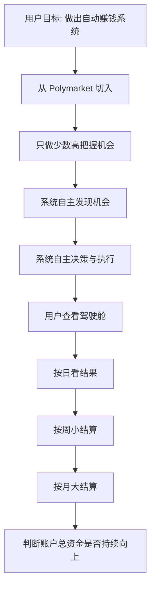

# Polymarket Auto Trading Income System

## Problem Frame

> Governance principle: Every major decision should be judged by one question, "Does this move the system closer to a stable money-printing machine?"

> Long-term framing: The end state is not "a trading project" but an account-level stable money-printing machine. Externally it should feel like one machine, even if internally it later grows multiple earning modes. The user wants it to become more like an asset and less like a job.

> Deep user value: The project is not only about adding one more income line. It is about turning that income line into something stable enough, trusted enough, and boring enough that the user can stop carrying ongoing anxiety about whether it is real, durable, or just luck.

用户真正想要的不是“做一个 Polymarket 项目”，也不是“做一个酷炫的交易产品”，而是做出一套能长期验证、逐步放大、尽量少依赖外部付费工具的自动赚钱系统。

当前 Polymarket 只是已知入口，不是不可替代的长期绑定场景。短期目标是先从 Polymarket 切入，找到一条窄而真实、可持续验证的赚钱路径；中期目标是让系统在用户可接受的风险边界内，尽量自主地发现机会、做出决策、执行交易，并按周和按月推动账户总资金正向上行。

用户不是要一套需要自己长期重度盯盘的新工作。用户接受前期介入较多、边看边调，但希望系统后续逐步走向“自己运作，我每天时不时看结果和状态”的形态。

第一阶段的产品形态已经进一步收紧为一套“克制型真钱验证系统”。它不是要在一开始就证明自己能覆盖多市场、多策略、多界面层，而是先在一个很窄的场景里证明：系统能挑对市场、会小仓验证、验证通过才加、环境不对就停，并且能用小额真钱持续赚钱。

## Requirements

**目标与收益方向**
- R1. 第一阶段产品目标必须围绕“形成一条可验证的自动赚钱路径”展开，而不是围绕“做出一个完整产品”展开。
- R2. 第一阶段必须优先争取周度和月度层面的账户总资金正向上行，而不是追求日度稳定盈利。
- R3. 系统默认追求的是“窄而真赚钱”的机会集合，而不是一开始覆盖大量市场和大量策略。
- R4. 产品应以结果为导向，只要风险边界内最终能赚钱，不要求用户个人判断深度参与每一笔交易。

**自动化与用户角色**
- R5. 系统应尽量覆盖从发现机会、形成判断到执行交易的完整链路，目标形态是高自主度运行，而不是长期依赖人工确认。
- R6. 用户在第一阶段可以承担观察、复盘和调优职责，但系统的目标形态不是“辅助人工交易”，而是“逐步独立运作”。
- R7. 系统必须为用户提供一个可观察的驾驶舱，但驾驶舱首要价值是让用户快速判断今天、本周、本月到底赚没赚钱，而不是展示复杂内部细节。

**风险、投入与边界**
- R8. 产品必须允许用户用可承受本金进行真实试错，但不应建立在购买外部收费交易工具或订阅服务的前提上。
- R9. 第一阶段默认接受 2 到 3 个月验证期，只要证据表明方向在改善，就不应以“短期未达理想收益”判定整个项目失败。
- R10. 系统评估优先级应以周度和月度结果为主，中间波动可以接受，但不能把短期过程波动包装成“已经稳定”。
- R11. 如果系统在周度或月度复盘中不能持续体现正向改进，则应把这视为核心问题，而不是用产品包装掩盖收益能力不足。

**范围控制**
- R12. 第一阶段只需要支持用户自用，不按对外产品标准设计用户体系、商业化流程或多人协作能力。
- R13. 第一阶段不应把“大而全的多市场、多策略、多角色平台”作为交付目标。
- R14. Polymarket 是当前入口，但需求定义不应把后续扩展到其他更优市场的可能性封死。

**第一阶段机会定义**
- R15. 第一阶段默认只优先关注“几天内会出结果”的明确事件市场，不以长周期、解释空间大的市场作为第一验证场景。
- R16. 系统第一优先级不是“提高交易次数”，而是“先挑出值得盯的市场”。
- R17. 第一阶段值得重点盯住的市场，至少应同时满足：结果较快揭晓、价格存在稳健优势、失败代价可控、且适合用小额真钱快速验证。
- R18. 对于“离结果近但价格没有明显优势”的市场，系统可以继续观察，但不应默认参与真实交易。

**第一阶段交易节奏**
- R19. 对“看起来有一点优势、但还不够硬”的机会，系统可以先进行小仓试探；试探的目标是验证真假，而不是抢跑或单纯刷参与度。
- R20. 小仓试探应在较短观察窗口内得到确认；如果在窗口内未被确认，即使没有明显变坏，也应默认退出，而不是长期占用资金等待。
- R21. 小仓试探被确认后，系统应采用分两步加仓的节奏；第二步加仓的主要目的应是二次确认，而不是激进放大利润。
- R22. 如果加仓后机会重新变得不对劲，系统应优先退回小仓，必要时直接退出，避免把已经通过初步验证的机会继续拿坏。
- R23. 如果当天连续 2 次试探都未被确认，系统应默认判定当日环境不对并收手，而不是继续硬找机会。
- R24. 如果前一天已因环境不对而提前收手，下一交易日开局应更保守；默认优先通过提高第一笔试探门槛来体现这种保守。
- R25. 第一阶段允许出现“整天没有交易”的结果，只要这意味着系统判断“暂无达标机会”，而不是系统失效。

**首页与日常交互**
- R26. 首页应是 3 秒可读懂的账户型结果面板，而不是多层研究型驾驶舱。
- R27. 首页最小必需信息应优先覆盖：当前总资金、今日/本周/本月盈亏、当前在外仓位、今日已实现/未实现，以及系统状态（运行中或已收手）。
- R28. 第一阶段默认不进行频繁主动打扰；用户主要通过主动打开首页查看结果。
- R29. 第一阶段最重要的主动提醒应是“今天已收手”，提醒内容应优先采用结果导向表达：先说明当前盈亏，再用一句话说明为何收手。
- R30. 第一阶段不应默认建设复杂第二页、多层行为解释界面或花哨的信息架构；策略与交易逻辑优先于界面层扩展。

## Success Criteria

- Future scope decisions can be filtered through a single standard: "Does this make the system more like a stable money-printing machine?" rather than simply more complex, more research-heavy, or more productized.
- Long-term success should feel less like "running a strategy" and more like "holding an income-producing asset": the system becomes trusted enough that the user no longer feels the need to constantly re-prove that it works.
- The desired emotional outcome is lower anxiety, not just higher returns: month by month the account should feel like it is steadily thickening, more like rent collection or a second salary than a speculative score.

- 用户可以清楚描述：这个系统的第一目标是形成真实可验证的赚钱路径，而不是完成一个漂亮的产品外壳。
- 第一阶段范围被控制在少量高把握机会，而不是一开始做成全能型交易平台。
- 用户可以通过驾驶舱快速看到日度结果，以及周度、月度的累计表现。
- 项目推进过程中，验证口径明确区分日度波动、周度小结算和月度大结算。
- 后续规划和实现不会默认依赖付费外部工具作为前提。
- 第一阶段的“成立”标准更具体地被收敛为：在一个很窄的市场场景里，用小额真钱连续 2 到 3 周整体赚钱。
- 第一阶段行为应表现出明确的克制性：会筛市场、会小仓验证、验证不通过会退出、环境不对会收手。
- 首页范围被压缩到结果和状态，不扩展成复杂多页控制台。

## Scope Boundaries

- 第一阶段不追求覆盖所有 Polymarket 市场。
- 第一阶段不追求复杂对外产品形态。
- 第一阶段不以“每天都赚钱”作为成功定义。
- 第一阶段不把购买现成收费机器人、收费信号或收费控制台当作默认方案。
- 第一阶段不以炫技式策略复杂度为目标。
- 第一阶段不把“多页驾驶舱”“解释性面板齐全”“行为日志产品化”作为优先目标。
- 第一阶段不默认追求高频出手或持续制造交易动作。

## Key Decisions

- Use "stable money-printing machine" as the top governance principle for the project: new complexity, new strategies, and new UI should enter scope only when they clearly improve durable earning power or earning frequency.
- Treat the system as an account-level machine, not a visible bundle of strategies: internally it may later grow different earning modes, but externally the user should still experience it as one machine judged by the total account result.
- Optimize for trust and asset-like behavior, not for excitement: the preferred end state is closer to "second salary" or "rent-like income" than to high-variance opportunistic wins.

- 以赚钱能力为核心目标，而不是以产品完整度为核心目标：因为用户明确表示“系统做得漂亮但赚不到稳定的钱”是最不能接受的失败。
- 以自用控制台为第一阶段形态：因为用户当前目标是先为自己建立一条收入线，而不是先做对外产品。
- 以高自主度自动化为目标：因为用户希望系统在边界内自主找机会、自主决策、自主执行，而不是每次都由自己确认。
- 以周/月表现为核心结算口径：因为用户明确接受日内波动，但要求周和月层面的账户结果持续向上。
- 以 Polymarket 为起点而不是终点：因为用户当前只是先从自己已知的平台切入，不排斥后续切换到更适合赚钱的市场。
- 以“先挑对市场”作为第一阶段的首要能力：因为用户明确认为系统最重要的是策略和逻辑，而不是多层页面。
- 以“克制型验证节奏”作为第一阶段默认交易风格：因为用户接受少做、慢一点、很多天不动，前提是能更高胜率地完成真钱验证。
- 以单首页结果板作为第一阶段唯一必要界面：因为用户明确拒绝把产品做成花里胡哨的多页驾驶舱。
- 以“连续 2 次试探未确认则当天收手”作为默认环境判定口径：因为用户更不能接受低质量亏损，而不是错过部分机会。

## Dependencies / Assumptions

- 假设用户可以接受使用自有本金进行小范围真实试错。
- 假设第一阶段允许先做窄场景验证，再决定是否扩展市场、策略和自动化深度。
- 假设后续计划中会把“少花外部工具钱”作为明确约束，而不是事后再补充。

## Outstanding Questions

### Deferred to Planning

- [Affects R3][Needs research] 第一阶段最值得切入的“窄而真赚钱”机会类型是什么，应该如何判断它具备足够验证价值？
- [Affects R5][Technical] 在不牺牲风险控制的前提下，第一阶段自动化深度应该一步到位到什么程度？
- [Affects R27][Technical] 首页各项结果、仓位和状态信息应采用怎样的最小布局，才能做到 3 秒可读而不过载？
- [Affects R8][Needs research] 在尽量不依赖外部付费工具的前提下，哪些免费或低成本数据与执行能力足够支撑第一阶段？
- [Affects R10][Needs research] 周度和月度的“正向改进”应该如何具体定义，避免因为偶然波动误判系统质量？
- [Affects R17][Needs research] 第一阶段“稳健价格优势”的最小判断标准应如何定义，避免把热闹市场误当成好市场？
- [Affects R20][Technical] 小仓试探的短观察窗口应如何参数化，才能兼顾快闭环和避免噪音误判？
- [Affects R23][Technical] “连续 2 次试探未确认则收手”的规则，具体应如何与不同市场剩余时间和仓位状态联动？

## Next Steps

-> `/prompts:ce-plan` for structured implementation planning
